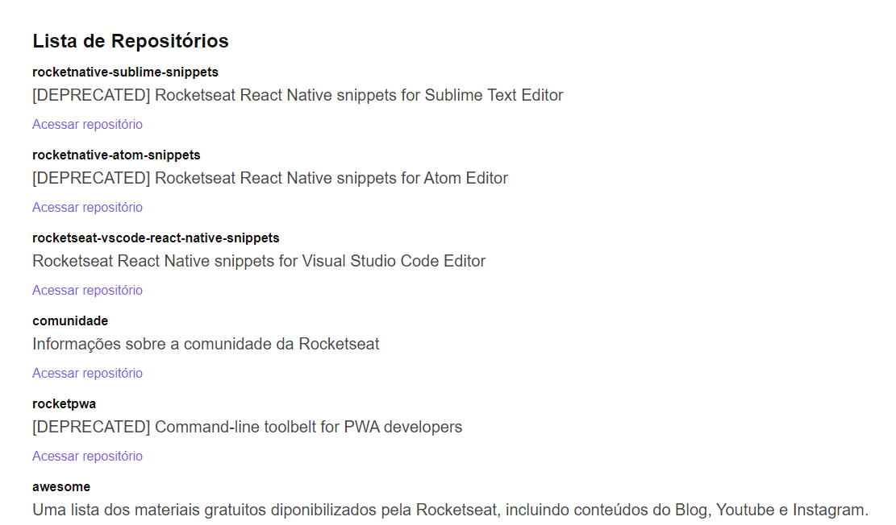

<h1 align="center">
  <a href="https://github-explorer-adk0ki371-leonardopess.vercel.app/" target="_blank">
    Github Explorer
  </a>
</h1>

<b>Github Explorer</b> foi desenvolvido ReactJS, listando os repositórios da Rockeseat

   
  
  

  

  

  

  

Projeto desenvolvido com o propósito de conhecer a base do React, onde fizemos toda a configuração do webpack, babel, entre outros!
Consegui reforçar meus conceitos e ver de perto as vantagens do ReactJS! Um ótimo começo 🚀🚀🚀

## Demo
https://github-explorer-adk0ki371-leonardopess.vercel.app/
